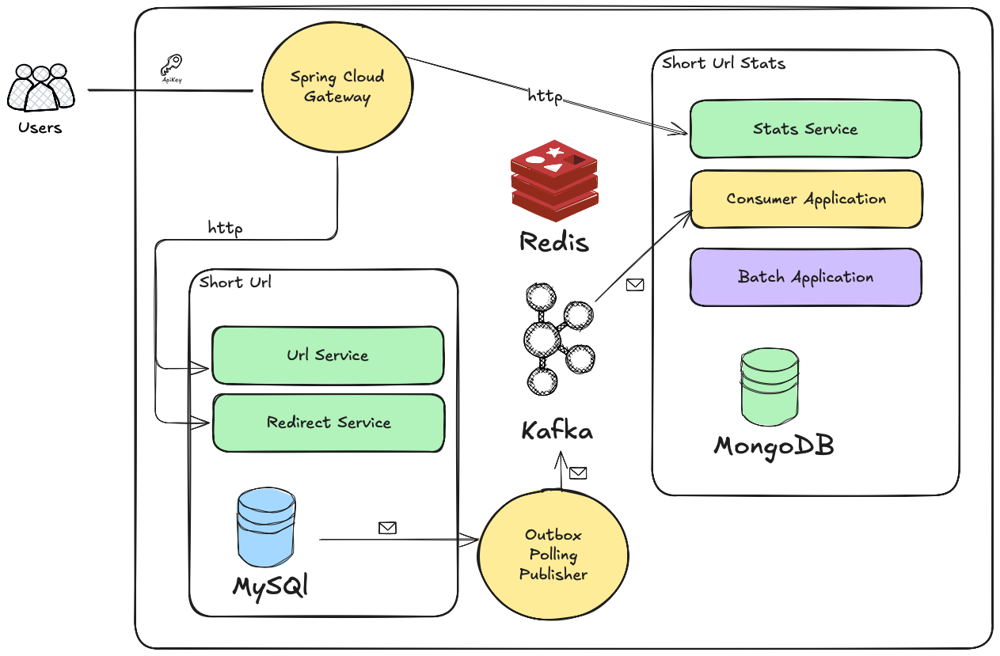
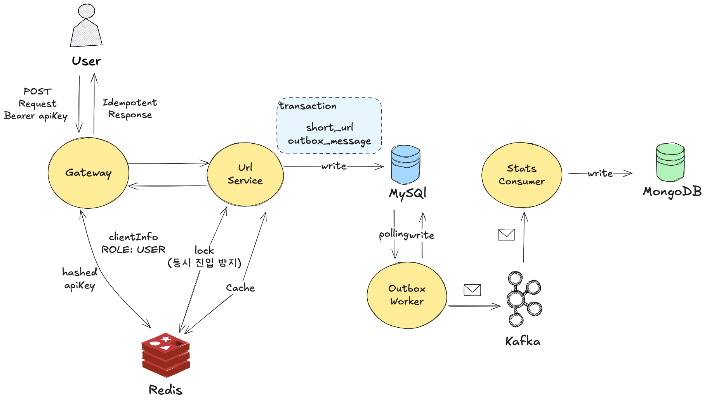
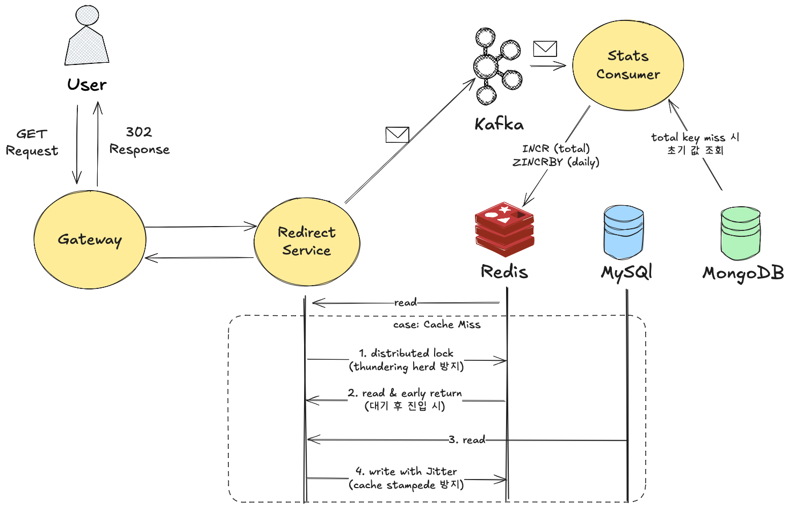
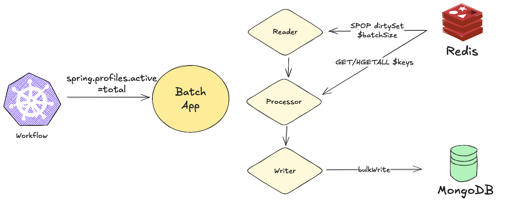
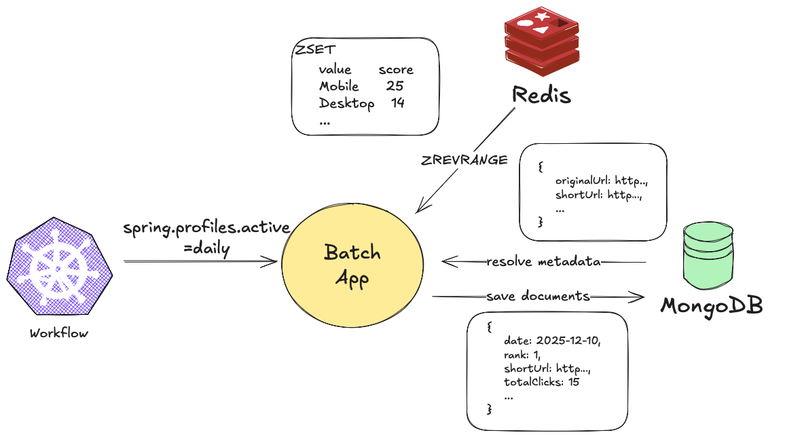
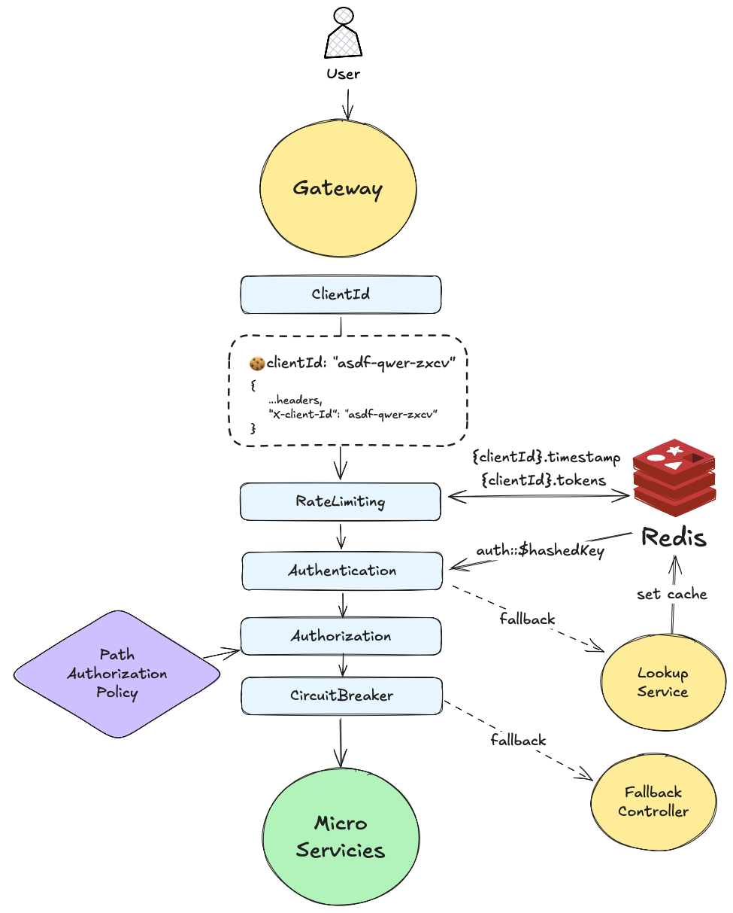

# MSA 기반 Short URL 분산 시스템 플랫폼


네이버 파이낸셜 Externship - TECH(BE)

author: 김도훈 (astor-dev)

- [api 명세](docs/API_SPEC.md)
- [이벤트 스키마 및 상세 설계](docs/EVENT_SCHEMA.md)
## 🚀 Getting Started

```shell
docker compose up -d --build
```
총 16개의 컨테이너가 실행됩니다. 실행 컴퓨터의 CPU 및 메모리 부하에 주의가 필요합니다.
### 인프라 컨테이너 실행
```shell
docker compose -f docker-compose.infrastructure.yml up -d --build  
```
서비스는 인프라 컨테이너가 모두 실행 된 후 실행해야 합니다.

### 서비스 컨테이너 실행
```shell
docker compose -f docker-compose.services.yml up -d --build  
```
6개의 서비스가 실행됩니다. CPU 및 메모리 부하에 주의가 필요합니다.
### 개별 서비스 로컬 실행

각 도메인의 실행 단위를 개별적으로 실행할 수 있습니다.

```shell
# Gateway
./gradlew :gateway:bootrun

# Short URL 도메인
./gradlew :short-url:api:url-service:bootrun
./gradlew :short-url:api:redirect-service:bootrun

# Short URL Stats 도메인
./gradlew :short-url-stats:api:stats-service:bootrun
./gradlew :short-url-stats:consumer:bootrun
java -jar short-url-stats/batch/build/libs/batch.jar --spring.profiles.active=total
java -jar short-url-stats/batch/build/libs/batch.jar --spring.profiles.active=daily

# Outbox
./gradlew :outbox:worker:bootrun
```

## 💾 인프라 컴포넌트

본 플랫폼은 다음 인프라 컴포넌트로 구성됩니다:

- **MySQL 8.0**: OLTP 데이터 저장소
  - Short URL 원천 데이터 저장
  - Outbox 패턴을 위한 이벤트 발행 테이블

- **MongoDB 7.0**: 통계 데이터 저장소
  - Short URL 통계 데이터 저장
  - 일별/디바이스별/Referrer별 집계 데이터 관리

- **Redis 7.4**: 캐시 및 실시간 통계 집계, 분산 락
  - Short URL 조회 캐시
  - 실시간 통계 집계를 위한 Sorted Set 활용
  - 클릭 수 집계 및 Top N 조회

- **Apache Kafka 4.1**: 이벤트 스트리밍 플랫폼
  - 3개 Controller 노드 (KRaft 모드)
  - 3개 Broker 노드
  - Replication Factor: 3, ISR: 2, Partition: 3, 
  - Kafka UI

---

## 📦 프로젝트 모듈 구조

```plaintext
gateway/
  └─ build.gradle.kts

short-url/
  ├─ api
  │  ├─ url-service
  │  └─ redirect-service
  └─ build.gradle.kts
  
short-url-stats/
  ├─ api
  │  └─ stats-service
  ├─ consumer
  ├─ batch  
  └─ build.gradle.kts

outbox/
  ├─ worker
  └─ build.gradle.kts

util/
  ├─ distributed-lock
  ├─ object-mapper
  └─ build.gradle.kts

build.gradle.kts
```

### 아키텍처 설계 원칙

- **도메인 단위 응집**: 비즈니스 도메인별로 최상위 모듈을 구성하여 높은 응집도를 유지합니다.
- **실행 단위 분리**: 각 도메인 내부에 독립적으로 배포 및 스케일링 가능한 실행 단위를 포함합니다.
- **도메인 모듈 공유**: 도메인 로직은 실행 단위 간 공유 가능하도록 설계했습니다.

### 도메인 모듈

각 도메인은 독립적인 비즈니스 영역을 담당하며, 내부에 실행 단위와 도메인 로직 모듈을 포함합니다.

#### 1. short-url 도메인

Short URL 생성 및 리다이렉트를 담당하는 핵심 도메인입니다.

| 도메인           | 기능                                                                         |
|---------------|----------------------------------------------------------------------------|
| **short-url** | ID 기반 Base64 인코딩으로 Short Key 생성, RDBMS 저장, 캐싱, 이벤트 발행                      |


| 모듈 | 포트 | 주요 기능                                 | 기술 스택                                            |
|------|------|---------------------------------------|--------------------------------------------------|
| **url-service** | 8081 | Short URL 생성, 중복 방지, 동시 진입 방지, 멱등성 보장 | Spring Boot Web, JPA, Redis, Spring Cloud Stream |
| **redirect-service** | 8082 | 리다이렉트 처리, 캐시 기반 조회                    | Spring Boot Web, JPA, Redis, Spring Cloud Stream |

#### 2. short-url-stats 도메인

Short URL 통계 집계 및 조회를 담당하는 도메인입니다.

| 도메인                 | 기능                                                                      |
|---------------------|-------------------------------------------------------------------------|
| **total-stats**     | Short URL 누적 통계 집계 및 조회 - Redis Hash 실시간 집계, 원자적 연산, MongoDB에 영속화       |
| **daily-top-stats** | Short URL 일간 통계 집계 및 조회 - Redis Sorted Set 실시간 집계, 원자적 연산, MongoDB에 영속화 |

| 모듈                        | 포트 | 주요 기능                       | 기술 스택                                          |
|---------------------------|------|-----------------------------|------------------------------------------------|
| **stats-service**         | 8083 | 통계 조회 API (상태/상세/Top N)     | Spring Boot Web, MongoDB, Redis                |
| **consumer**              | 8091 | Kafka 이벤트 소비, 통계 수집 (Redis) | Spring Boot, Redis, Spring Cloud Stream        |
| **batch**                 | 8092 | 누적/일간 통계 배치 집계 및 영속화        | Spring Boot, Spring Batch, MongoDB, Redis      |

### 인프라 모듈

도메인과 무관한 공통 인프라 및 유틸리티를 제공합니다.

#### 1. gateway

| 모듈 | 포트 | 주요 기능                                                    | 기술 스택                                 |
|------|------|----------------------------------------------------------|---------------------------------------|
| **gateway** | 8080 | API Gateway, 라우팅 처리, 인증/인가, RateLimiting, CircuitBreaker | Spring Cloud Gateway (WebFlux), Redis |

#### 2. outbox

이벤트 발행의 트랜잭션 일관성을 보장하는 인프라 모듈입니다.

| 모듈 | 기능                                                        |
|------|-----------------------------------------------------------|
| **outbox** | Outbox 패턴 구현에 필요한 기능 모듈 - 트랜잭션과 이벤트 발행 일관성 보장, `FOR UPDATE SKIP LOCKED` 분산 환경 지원    |

| 모듈 | 포트 | 주요 기능 | 기술 스택                                 |
|------|------|----------|---------------------------------------|
| **worker** | 8090 | Outbox 패턴 구현, 이벤트 발행 (0.5초 주기, 배치 50건) | Spring Boot, JPA, Spring Cloud Stream |

#### 3. util 모듈

| 모듈 | 기능                                                              |
|------|-----------------------------------------------------------------|
| **distributed-lock** | 분산 환경에서 락을 통한 동시성 제어를 제공 - Redisson 기반 분산 락 실행기, 락 획득/해제 자동화, 예외 상황에서도 락 해제 보장             |
| **object-mapper** | 공통 Jackson ObjectMapper 유틸리티 모듈 - JavaTimeModule, KotlinModule 등 공통 모듈 등록, 프로젝트 전역에서 일관된 직렬화/역직렬화 |


## ⚙️️ 주요 파이프라인

### Short URL 생성



Short URL 생성은 **멱등성 보장**과 **동시성 제어**를 핵심으로 설계되었습니다.

#### 1. Key 생성 알고리즘

DB가 할당한 ID(auto_increment)를 **Base64 URL-Safe (No Padding)** 형식으로 인코딩합니다.

**트레이드오프**:
- **장점**: 
  - UUID/해시 기반 방식과 비교하여 길이가 짧고 충돌 가능성이 없습니다.
  - 인코딩/디코딩이 단순하여 성능 오버헤드가 적습니다.
- **단점**: 
  - 클라이언트가 ShortKey를 복호화하여 ID를 알 수 있습니다.
  - 이를 통해 PK가 누설되어 다음 URL을 예측할 수 있는 등 보안 상 취약할 수 있습니다.

Short URL 서비스의 특성상 **짧은 길이**와 **충돌 방지**가 더 중요하다 판단했습니다.

#### 2. 동시성 제어

**분산 락 (Redis)**: 
- 원본 URL을 락 키로 사용하여 동일한 URL에 대한 동시 생성 요청을 방지합니다.
- originalUrl 기반 유효성 검사 이후 쓰기 작업이 진행 중 일 때 다른 트랜잭션이 커밋되어 중복 생성 및 멱등성이 깨지는 것을 막기 위함입니다.
- Critical section 내에서 캐시 확인, DB 조회, 생성 로직이 원자적으로 실행됩니다.

#### 3. 이벤트

**Outbox 패턴**:
- 트랜잭션 내에서 `event_publication` 테이블에 이벤트를 저장합니다.
- `outbox-worker`가 0.5초 주기로 폴링하여 Kafka로 발행합니다.
- 트랜잭션 커밋과 이벤트 발행의 원자성을 보장하여 이벤트 손실을 방지합니다.

**Stats Consumer**:
- 통계 도메인에서 활용할 Document를 생성 이벤트 Payload 기반 비동기로 생성합니다.
- `INSERT IF NOT EXISTS`를 통해 생성의 멱등성을 보장합니다.

### Short URL 리다이렉트



Short URL 리다이렉트는 **응답 시간 최우선**과 **캐시 최적화**를 핵심으로 설계되었습니다.

#### 1. 캐시 처리 전략

**특정 Hot Key Thundering Herd 방지**:
- 캐시 미스 발생 시 분산 락을 획득하여 동시에 여러 요청이 MySQL에 접근하는 것을 방지합니다.
- 락 획득 후 재차 캐시를 확인하여 다른 프로세스가 캐시를 채운 경우 early return합니다.

**전체 시스템 부하 분산**:
- 캐시 TTL에 0~60분의 랜덤 값(Jitter)을 추가하여 만료 시각을 분산시킵니다.
- 동일한 시각에 많은 캐시 항목이 동시에 만료되는 것을 방지합니다.

#### 2. 이벤트

**이벤트 발행**:
- 리다이렉트 응답 후 비동기로 클릭 이벤트를 발행합니다.
- `sync: false` 설정으로 응답 시간에 영향을 주지 않도록 보장합니다.
- `ack: 0` 설정으로 Fire-and-forget 방식으로 즉각 발행합니다.
- Outbox 패턴 없이 직접 Kafka로 발행하여 응답 지연을 최소화합니다.

**트레이드오프**:
- **장점**: 
  - 응답 시간에 영향을 주지 않아 10ms 이내 응답을 보장합니다.
  - 높은 처리량(일일 약 10,000,000건)을 처리할 수 있습니다.
- **단점**: 
  - 일부 이벤트 손실 가능성이 있습니다.
  - 이벤트 발행 실패 시 재시도하지 않습니다.

다량 쏟아지는 클릭 이벤트 특성 상 어느정도의 유실을 감수하고 성능을 챙기는 것이 낫다고 판단했습니다. 

**Stats Consumer**:
- MongoDB 부하를 방지하기 위해 Redis를 우선 활용합니다.
- **누적 통계**
  - `INCR` / `HINCRBY`로 Redis에 누적 클릭 수를 저장합니다.
  - 누적 통계 미스 시 MongoDB에서 초기값을 조회하여 Redis에 세팅합니다.
  - shortKey를 dirtySet에 저장합니다. 추후 배치에서 동기화할 url을 식별하는데 사용합니다. 
- **일간 통계**
  - `ZINCRBY`로 Redis Sorted Set에 일별 클릭 수를 집계합니다.
  - Sorted Set을 활용하여 Top N 조회 성능을 최적화합니다.
- **배치 동기화**
  - Redis에 저장된 통계 데이터를 배치 작업을 통해 MongoDB에 동기화합니다. (Write Back)
  - 실시간 집계는 Redis에서 수행하고, 영속화는 MongoDB에 비동기로 저장합니다.

**트레이드오프**:
- **장점**: 
  - Redis의 원자적 연산(`INCR`, `ZINCRBY` 등)을 활용하여 실시간 집계 성능이 우수합니다.
  - MongoDB 쓰기 부하를 크게 감소시켜 높은 처리량(일일 약 10,000,000건)을 처리할 수 있습니다.
  - Sorted Set을 활용하여 Top N 조회를 O(log N) 시간 복잡도로 최적화할 수 있습니다.
  - 실시간 통계 조회 시 MongoDB 조회 없이 Redis에서 즉시 응답 가능합니다.
- **단점**: 
  - 배치 동기화 주기 동안 MongoDB와 Redis 간 최종 일관성이 지연됩니다.
  - Redis 장애 시 배치 동기화 전 데이터가 손실될 수 있습니다.
  - 배치 작업 지연 또는 실패 시 MongoDB 반영이 누락될 수 있습니다.

실시간 통계 조회가 중요하고 높은 처리량이 필요한 환경에서, 어느 정도의 지연된 일관성을 감수하고 성능을 우선시하는 것이 낫다고 판단했습니다.

### 캐시 동기화 배치 작업

캐시 동기화는 Redis를 중심으로 수집된 통계를 지연 반영(Write-Back) 방식으로 MongoDB에 저장하는 구조입니다. 실시간 경로의 가벼움과 최종 일관성 확보를 동시에 달성하는 것이 목적입니다.

#### 1. 누적 집계 동기화


- Redis dirtySet에 마킹된 shortKey만을 대상으로 합니다. 
- `SPOP`을 사용하여 batch-size 단위로 처리하므로 메모리 및 I/O 부하를 제어할 수 있습니다.
- Reader는 pop된 키들에 대해 Redis에서 누적 통계(`HGETALL` / `GET` 등)를 조회합니다.
- Writer는 MongoDB에 `bulkWrite`로 반영합니다.

#### 2. 일간 Top N 통계 집계 동기화


- Redis Sorted Set에서 `ZREVRANGE`를 사용하여 일별 클릭 수 기준 Top N 데이터를 조회합니다.
- 조회된 shortKey를 기반으로 MongoDB에서 메타데이터(originalUrl, shortUrl 등)를 resolve합니다.
- 일자, 순위(rank), shortUrl, 총 클릭 수(totalclicks) 등을 포함한 랭킹 문서를 생성합니다.
- 생성된 문서를 MongoDB에 일 단위 스냅샷으로 저장하여 실시간 집계 값을 영속화합니다.

### Gateway 요청 처리 파이프라인


Gateway 요청 처리는 **최소한의 연산**만 수행하고, **신뢰가 요구되는 구간에서만 선택적으로 개입**하여 안정성을 보장할 수 있게 설계하였습니다. 

각 단계는 서로 의존하며, 전체 구조는 “앞단에서 최대한 차단하고, 뒤로 갈수록 최소한의 검증만 수행한다”는 원칙을 기반으로 구성됩니다.


#### 1. 요청 식별 및 유량 제어

클라이언트의 요청을 식별하고 시스템이 감당 가능한 수준으로 트래픽을 조절하여 백엔드 서비스를 보호합니다.

**Client ID 식별:**
- 헤더(X-client-Id) 또는 쿠키 기반으로 요청 주체를 식별합니다. 
- 무분별한 요청을 차단하고, 테넌트를 식별하여 로깅하거나 개별 정책을 적용하기 위한 기초 데이터로 활용합니다.

**Rate Limiting:**
- spring cloud gateway + Redis를 활용하여 다중 인스턴스 환경에서도 정확한 유량 제어를 보장합니다.
- {clientId}.tokens, {clientId}.timestamp 키를 사용하여 토큰 버킷 또는 윈도우 카운터 방식으로 요청 수를 제한합니다. 
- DB 접근 전 캐시 레이어에서 과도한 트래픽을 사전에 차단하여 리소스를 확보합니다.

#### 2. 인증 및 인가 전략

**Api Key 기반 Stateful 토큰 검증:**
- 키가 주어진 경우, Redis에 저장된 hashedKey를 조회하여 유저를 인증합니다.
- 캐시 히트 시 빠르게 인증을 통과시키고, 만료 시 LookupService를 통해 인증 정보를 조회합니다.
- 인증된 정보의 Role을 기반 Url의 Access Control을 수행합니다. 
- 보안 이슈 발생 시 서버에서 즉시 접근 권한을 무효화 할 수 있습니다.

**한계:**
  - 키가 제공된 요청마다 Redis 네트워크 I/O가 발생하여 JWT 등 Stateless 방식에 비해 지연 시간이 추가됩니다. 
  - Redis 장애 시 인증 서비스에 과한 트래픽이 몰릴 수 있습니다.
  - 유저 서비스의 부재로 개별 자원에 대한 권한 관리는 제공되지 않습니다.

서비스 대부분의 트래픽인 리다이렉트는 인증/인가가 발생하지 않습니다. 따라 인증 시스템 장애로부터도 자유롭습니다.

그 외의 트래픽은 수가 적고, 보안 통제 및 세션 관리가 중요하다 생각하여 Stateful한 Api Key 기반 인증/인가를 채택하였습니다.

#### 3. 장애 격리 및 회복 탄력성 (Resilience)

시스템의 안정성을 위해 `spring-cloud-circuit-breaker`를 도입하여, 특정 서비스의 장애가 게이트웨이 전체 리소스 고갈로 이어지는 것을 방지합니다. 각 API의 역할과 부하 특성에 맞춰 임계치를 세밀하게 조정했습니다.

**1) 리다이렉트 API (`redirect-circuit`)**
- 실패율 30% / 느린 호출 100ms / 복구 대기 5초 
- 아주 짧은 지연(100ms 이상)도 병목을 유발하므로 즉시 차단하여 게이트웨이 스레드를 보호합니다. 
- 장애가 해소되면 최대한 빨리 서비스를 재개해야 하므로, 복구 대기 시간 **5초**로 가장 짧게 설정했습니다.

**2) 생성 API (`create-circuit`)**
- 실패율 50% / 느린 호출 500ms / 복구 대기 10초
- DB Insert 및 키 생성 로직이 포함되므로, 느린 호출 기준을 **500ms**로 설정하여 정상적인 쓰기 지연을 장애로 오판하지 않도록 했습니다.
- 멱등성이 보장되므로 실패율을 50%까지 관대하게 허용하여, 지연 시 즉시 차단하기보다 클라이언트의 재시도를 유도합니다.

**3) 상태 조회 API (`state-circuit`)**
- 실패율 50% / 느린 호출 500ms / 복구 대기 10초
- 캐시 미스 시 mongoDB 조회를 하는 worst case를 고려하여 여유롭게 **500ms**를 설정했습니다.
- 생성 API와 값은 같으나 추후 트래픽 특성이나 요구사항 변동 시 대비하기 위해 설정 값을 분리했습니다.

**4) 통계 조회 API (`statistics-circuit`)**
- 실패율 50% / 느린 호출 1,000ms / 복구 대기 15초
- 캐시 미스 시의 DB 집계 쿼리 및 일반적으로 페이로드 자체가 크기에 충분히 여유로운 **1000ms**를 설정했습니다.   
- DB 부하로 인해 장애가 발생했을 가능성이 높으므로, 복구 대기 시간을 **15초**로 가장 길게 설정하여 하위 DB가 부하를 정리하고 회복할 충분한 시간을 부여합니다.

모든 서킷 브레이커는 Open 상태 전환 시 즉시 Fallback 응답을 반환하여 클라이언트의 무한 대기를 방지하는 **Fail-Fast** 원칙을 준수합니다.

## 📊 부하 테스트 요약

요구사항에서 제시한 트래픽 규모(생성 일 100만 건, 리다이렉트 일 1,000만 건)를 기준으로,
전용 트래픽 생성기([traffic-generator](traffic-generator/README.md))를 활용하여 기본 시나리오에 대한 부하 테스트를 수행했습니다.

테스트는 Macbook M3 Pro(8-core/16GB) 로컬 환경에서 모든 인프라 및 서버, 트래픽 생성 애플리케이션을 실행해두고, **통상 트래픽 수준의 1분 부하**를 재현했습니다.

### 시나리오 개요

| 시나리오 | 대상 API | threads | 기준  | durationSeconds | requestIntervalMs |
|---------|---------|---------|-----|----------------|-------------------|
| CREATE | URL 생성 (`/api/v1/urls`) | 10      | 시간  | 60 | 862 |
| REDIRECT | 리다이렉트 (`/{shortKey}`) | 10      | 시간  | 60 | 86 |

### 결과 요약

| 시나리오                                                                 | success / total | Avg(ms) | P50(ms) | P95(ms) | P99(ms) | Min(ms) | Max(ms) |
|----------------------------------------------------------------------|-----------------|---------|---------|---------|---------|---------|---------|
| [CREATE](traffic-generator/reports/create_20251209_165503.json)      | 620 / 620       | 103     | 91 | 199 | 363 | 38      | 365     |
| [REDIRECT](traffic-generator/reports/redirect_20251209_165226.json)  | 5,930 / 5,930   | 11      | 10 | 22 | 71 | 2       | 202     |


해당 결과는 모든 인프라·서버·트래픽 생성기를 단일 Macbook 로컬 환경에서 함께 실행한 상태에서 얻은 값으로, 절대적인 성능 지표라기보다는 전반적인 경향을 확인하기 위한 참고용 수치입니다.  

그럼에도 통상 트래픽 수준에서 생성·리다이렉트 요청이 모두 에러 없이 안정적으로 처리되었고, 특히 리다이렉트는 요구사항에서 제시한 응답 시간 범위(수 ms~수십 ms)를 대략 만족하는 것으로 보입니다.

## 📈 확장 방향

### DLQ 활용 실패 토픽 격리

#### As-Is
- Kafka Consumer에서 메시지 처리 실패 시 재시도나 격리 메커니즘이 없음
- 일시적인 오류나 잘못된 형식의 메시지로 인해 Consumer가 멈추거나 메시지가 손실될 수 있음
- 실패한 메시지에 대한 추적 및 분석 불가능
- 에러 발생 시 수동 개입 없이는 복구 어려움

#### To-Be
- **Dead Letter Queue 토픽(DLT) 생성**: 실패한 메시지를 격리할 전용 토픽 구성
- **에러 핸들링 전략**:
  - 최대 재시도 횟수 설정 (예: 3회)
  - 백오프 전략 설정(지수적 백오프 등)
  - 재시도 후에도 실패한 메시지는 DLT로 전송
  - 원본 메시지와 함께 실패 원인(에러 메시지, 스택 트레이스)을 메타데이터로 저장
- **모니터링 및 알림**:
  - DLT의 메시지 수 모니터링
  - 임계값 초과 시 알림 발송

**기대 효과**:
- Consumer의 안정성 향상 (일부 실패 메시지로 인한 전체 Consumer 중단 방지)
- 실패한 메시지의 추적 및 분석 가능
- 데이터 손실 방지 및 복구 가능성 확보

### 인증/유저 서비스 추가

#### As-Is
- Gateway의 [ClientLookupService](gateway/src/main/kotlin/com/naver/pay/filter/auth/ClientLookupService.kt)에서 하드코딩된 Mock 클라이언트 정보 사용
- API Key 생성/관리 기능 없음
- 클라이언트 정보 동적 변경 불가능
- 운영 환경에서 사용 불가능한 상태

#### To-Be
- **유저 서비스 도메인 추가**:
  - API Key 생성/관리 기능
  - 클라이언트 정보 조회 API
  - 역할 및 권한 관리
  - API Key 활성화/비활성화 기능

- **Gateway 연동**
  - `ClientLookupService`를 유저 서비스와 통신하도록 변경

**기대 효과**:
- 실제 운영 환경에서 사용 가능한 인증/인가 시스템 구축
- 클라이언트별 세밀한 접근 제어 및 모니터링 가능
- API Key 생명주기 관리 및 보안 정책 적용 가능

### 헤더 변조 감지

#### As-Is
- Gateway가 `Referer` 헤더를 포함한 요청 헤더를 별도 검증 없이 그대로 전달
- 악성/오남용 클라이언트가 임의의 `Referer` 값을 무차별로 보내는 경우, 캐시 키 조합 수가 폭증할 수 있음
- 헤더 변조 또는 비정상 패턴에 대한 별도 관측/차단 로직 부재

#### To-Be
- **헤더 화이트리스트/정규화 적용**:
  - 캐시 키 구성에 사용되는 헤더를 최소화하고, `Referer`는 캐시 키에서 제거하거나 도메인 단위로 정규화
  - 비정상적으로 긴 `Referer` 또는 허용되지 않은 형식은 잘라내거나 기본값으로 대체
- **헤더 이상 패턴 감지**:
  - 단일 Client ID 또는 IP에서 짧은 시간 안에 서로 다른 `Referer` 값이 과도하게 발생하는 경우 이상 트래픽으로 간주
  - 이상 패턴 탐지 시 캐시 미사용 경로로 우회하거나 요청 자체를 차단
- **관측 및 알림 연동**:
  - 헤더 변조/이상 탐지 카운터를 메트릭으로 노출하고, 임계치 초과 시 알림을 발송

**기대 효과**:
- `Referer` 기반 높은 카디널리티의 캐시 키 생성을 방지하여 Redis 캐시 효율과 메모리 사용을 안정적으로 유지
- 악성 트래픽으로 인한 캐시 폭증 및 백엔드 서비스 부하 급증을 사전에 차단